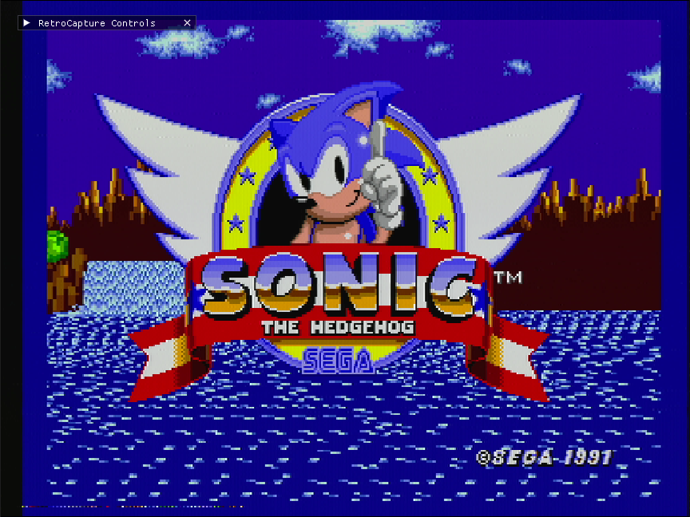
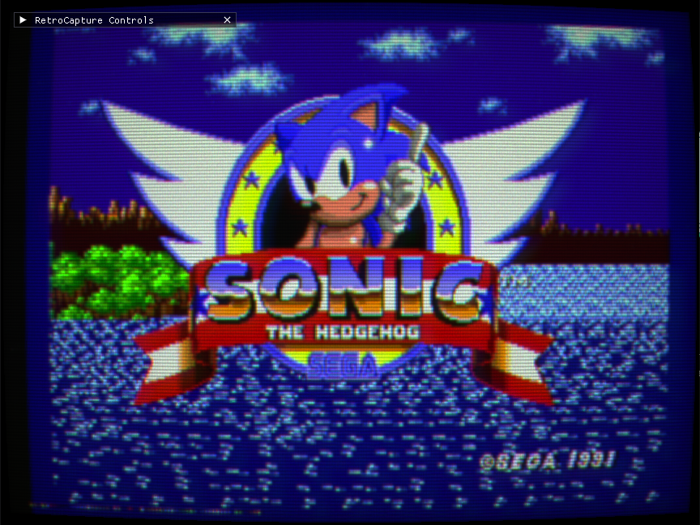
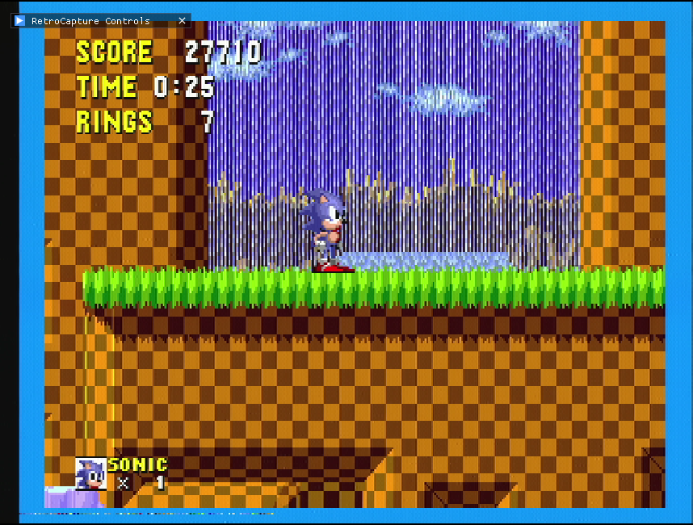
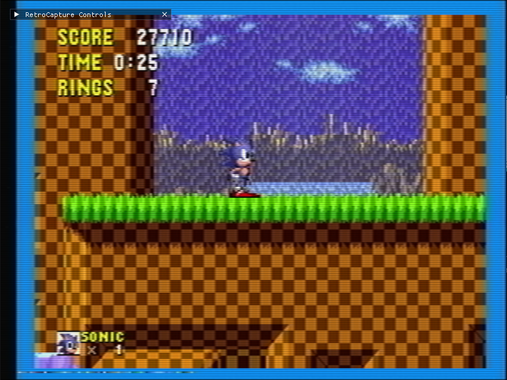

# RetroCapture

RetroCapture is a real-time video capture application for Linux and Windows that allows you to apply RetroArch shaders (GLSL) to live video feeds from capture cards, providing authentic retro visual effects and advanced image processing.

## 🎯 Motivation

RetroCapture was born from the desire to experience retro gaming with the authentic feel of classic CRT televisions, while also supporting modern upscaling techniques used in real hardware emulators. The project aims to bridge the gap between nostalgic visual experiences and modern capture technology.

### Key Motivations

- **Authentic Retro Experience**: Apply CRT shaders to recreate the look and feel of classic tube televisions, complete with scanlines, phosphor glow, and curvature effects
- **Modern Upscaling**: Use advanced upscaling shaders (xBR, Super-xBR, etc.) to enhance image quality while maintaining the retro aesthetic
- **Real Hardware Emulation**: Achieve visual fidelity similar to what you'd get from real hardware emulators like the Analogue Pocket, MiSTer, or FPGA-based systems
- **Live Processing**: Process video in real-time from capture cards, allowing you to stream or record with shader effects applied instantly
- **Flexibility**: Support for hundreds of RetroArch shaders, giving you the freedom to customize your visual experience

## ⚠️ Development Status

**RetroCapture is currently in active development (v0.4.0-alpha).**

### Shader Support

While many shaders work perfectly, not all shaders function as expected. Some complex multi-pass presets may have issues, and certain shader features may not be fully implemented yet. However, a significant number of shaders are working well, including:

- ✅ Most CRT shaders (CRT-Geom, CRT-Pi, CRT-Guest, etc.)
- ✅ NTSC/PAL shaders
- ✅ Upscaling shaders (xBR, Super-xBR, etc.)
- ✅ Handheld console shaders (Game Boy, Game Boy Color, etc.)
- ✅ Many single-pass and simple multi-pass shaders

### Streaming Status

- ✅ **H.264**: Fully functional and stable
- ✅ **H.265**: Fully functional with profile and level support
- ⚠️ **VP8/VP9**: Functional but may appear as "Data: bin_data" in some players (implementation incomplete)

We're continuously working to improve compatibility and add support for more shader features. Contributions and bug reports are welcome!

## ✨ Features

### Video Capture & Processing

- ✅ Real-time video capture via V4L2 (Linux) or DirectShow (Windows)
- ✅ Full support for RetroArch shaders (GLSL)
- ✅ Multi-pass presets
- ✅ Hardware controls (V4L2 on Linux, DirectShow on Windows)
- ✅ Fullscreen and multi-monitor support
- ✅ Aspect ratio maintenance
- ✅ Real-time shader parameter editing
- ✅ Cross-platform architecture with platform-specific implementations

### Streaming (NEW in 0.2.0-alpha)

- ✅ **HTTP MPEG-TS Streaming**: Stream your processed video over HTTP
- ✅ **Multi-Codec Support**: H.264, H.265/HEVC, VP8, and VP9
- ✅ **Audio Streaming**: PulseAudio (Linux) or WASAPI (Windows) integration for system audio capture
- ✅ **Real-time A/V Synchronization**: Timestamp-based synchronization system
- ✅ **Multiple Concurrent Clients**: Support for multiple viewers simultaneously
- ✅ **Configurable Quality**: Adjustable bitrates, presets, and codec-specific options

### Web Portal

- ✅ **Remote Control Interface**: Complete web-based control panel
- ✅ **REST API**: Full API for remote control of all features
- ✅ **Real-time Updates**: Live status updates and bidirectional communication
- ✅ **Progressive Web App (PWA)**: Installable on mobile and desktop
- ✅ **HTTPS Support**: Optional SSL/TLS encryption
- ✅ **Customizable UI**: Colors, images, and text labels
- ✅ **Independent Operation**: Can run separately from streaming

### User Interface

- ✅ Graphical interface with ImGui
- ✅ Configuration persistence (automatic save/load)
- ✅ Stream management UI with codec selection
- ✅ Real-time stream status and client count
- ✅ Web portal with remote control
- ✅ Modular UI architecture with separate classes per tab

### Distribution

- ✅ Portable AppImage distribution (Linux)
- ✅ Windows Installer (NSIS)

## 📸 Visual Examples

### Comparison: Without Shader vs. With Shader

RetroCapture allows you to apply RetroArch shaders in real-time to your video capture, transforming the visual appearance with authentic retro effects.

#### CRT Shader (Mattias)

| Without Shader                                                 | With CRT Mattias Shader                                       |
| -------------------------------------------------------------- | ------------------------------------------------------------- |
|  |  |

#### NTSC Shader

| Without Shader                                           | With NTSC Shader                                        |
| -------------------------------------------------------- | ------------------------------------------------------- |
|  |  |

## 📋 Requirements

### Core Dependencies

**Linux:**

- Linux (with V4L2 support)
- OpenGL 3.3+
- GLFW 3.x
- libv4l2
- libpng
- X11 (for window manager integration)
- CMake 3.10+
- C++17 compiler

**Windows:**

- Windows 7+ (tested on Windows 10/11 and Wine)
- DirectShow-compatible capture devices
- OpenGL 3.3+ support
- CMake 3.10+ (for building)
- MinGW-w64 or MSVC (for building)

### Streaming Dependencies (for streaming features)

- **FFmpeg** (libavcodec, libavformat, libavutil, libswscale, libswresample)
  - **libx264**: For H.264 encoding
  - **libx265**: For H.265/HEVC encoding (optional)
  - **libvpx**: For VP8/VP9 encoding (optional)
  - **libfdk-aac** or **libavcodec AAC**: For audio encoding
- **PulseAudio** (Linux) or **WASAPI** (Windows): For audio capture
- **nlohmann/json**: For configuration persistence (automatically fetched by CMake)

### Web Portal Dependencies (for web portal features)

- **OpenSSL** (optional): For HTTPS support
  - Install: `sudo pacman -S openssl` (Arch/Manjaro) or `sudo apt-get install libssl-dev` (Ubuntu/Debian)

## 🔨 Building

### Linux (nativo)

```bash
# Build
./build.sh

# Run
./build/bin/retrocapture
```

### Windows (cross-compile do Linux)

**Opção 1: Gerar Instalador Windows (Recomendado) ⭐**

A forma mais simples para distribuir:

```bash
# Gerar instalador Windows completo
./tools/build-windows-installer.sh
```

Isso irá:

1. Compilar a aplicação via Docker
2. Gerar instalador NSIS (`RetroCapture-{VERSION}-Windows-Setup.exe`)
3. Incluir todos os componentes (executável, DLLs, shaders, assets, web portal, SSL)

O instalador estará no diretório raiz do projeto.

**Opção 2: Build Manual (apenas executável)**

```bash
# Primeira vez (pode demorar 30-60 min para compilar MXE)
docker-compose build build-windows
docker-compose run --rm build-windows

# Builds seguintes (muito mais rápido)
docker-compose run --rm build-windows
```

O executável estará em `./build-windows-x86_64/bin/retrocapture.exe`

## 📖 Usage

### Basic Usage

```bash
# Basic capture (V4L2 source)
./build/bin/retrocapture --source v4l2 --v4l2-device /dev/video0

# With shader
./build/bin/retrocapture --source v4l2 --preset shaders/shaders_glsl/crt/crt-guest-dr-venom.glslp

# Custom resolution and framerate
./build/bin/retrocapture --width 1920 --height 1080 --fps 60

# Fullscreen
./build/bin/retrocapture --fullscreen --monitor 0

# Dummy mode (no capture device)
./build/bin/retrocapture --source none
```

### Streaming

Streaming can be configured and started via the GUI (Stream tab), web portal, or CLI. Once streaming is active:

1. **Access the stream**: Open `http://localhost:8080/stream` in a media player (VLC, ffplay, mpv, etc.)
2. **Multiple clients**: Multiple viewers can connect simultaneously
3. **Codec selection**: Choose from H.264, H.265, VP8, or VP9 codecs
4. **Audio included**: System audio is automatically captured and streamed (via PulseAudio)

**Example with ffplay**:

```bash
# In one terminal, start RetroCapture
./build/bin/retrocapture --preset shaders/shaders_glsl/crt/crt-pi.glslp

# In another terminal, view the stream
ffplay http://localhost:8080/stream
```

**Example with VLC**:

```bash
# Open VLC → Media → Open Network Stream
# Enter: http://localhost:8080/stream
```

### Web Portal

The web portal provides a complete remote control interface accessible from any device on your network:

1. **Access the portal**: Open `http://localhost:8080` (or `https://localhost:8080` if HTTPS is enabled) in a web browser
2. **Control everything**: Adjust shaders, resolution, FPS, image settings, streaming, and V4L2 controls remotely
3. **Real-time updates**: All changes are applied immediately without refresh
4. **Install as PWA**: On mobile devices, you can install the portal as a Progressive Web App for easy access

**Enable web portal via CLI**:

```bash
# Enable web portal (enabled by default)
./build/bin/retrocapture --web-portal-enable

# Enable with HTTPS
./build/bin/retrocapture --web-portal-https --web-portal-ssl-cert ssl/server.crt --web-portal-ssl-key ssl/server.key

# Custom port
./build/bin/retrocapture --web-portal-port 9000
```

**Access from mobile device**:

1. Find your computer's local IP (e.g., `192.168.1.100`)
2. Open `http://192.168.1.100:8080` on your mobile device
3. Install as PWA (if HTTPS is enabled) for native app experience

**Note**: For PWA installation on local network IPs, HTTPS is required. See `ssl/README.md` for certificate generation instructions.

### Command-Line Parameters

#### Shader Options

- `--shader <path>`: Load a simple GLSL shader file (.glsl)
- `--preset <path>`: Load a RetroArch shader preset (.glslp)

#### Source Type

- `--source <type>`: Select source type
  - Linux: `none` (dummy mode) or `v4l2` (default: `v4l2`)
  - Windows: `none` (dummy mode) or `ds` (DirectShow, default: `ds`)

#### Capture Resolution and Framerate

- `--width <pixels>`: Capture width (default: 1920)
- `--height <pixels>`: Capture height (default: 1080)
- `--fps <fps>`: Capture framerate (default: 60)

#### Window Configuration

- `--window-width <pixels>`: Initial window width (default: 1920)
- `--window-height <pixels>`: Initial window height (default: 1080)
- `--fullscreen`: Start in fullscreen mode
- `--monitor <index>`: Select monitor for fullscreen (-1 = primary, 0+ = specific monitor)
- `--maintain-aspect`: Maintain aspect ratio when resizing window

#### Image Processing

- `--brightness <value>`: Overall image brightness (0.0 to 2.0, default: 1.0)
- `--contrast <value>`: Overall image contrast (0.0 to 2.0, default: 1.0)

#### Hardware Controls

**Linux (V4L2):** These parameters are only applied when `--source v4l2`. They directly control the capture device hardware settings. Values are device-specific and may vary.

- `--v4l2-device <path>`: V4L2 device path (default: `/dev/video0`)
- `--v4l2-brightness <value>`: V4L2 brightness control (-100 to 100)
- `--v4l2-contrast <value>`: V4L2 contrast control (-100 to 100)
- `--v4l2-saturation <value>`: V4L2 saturation control (-100 to 100)
- `--v4l2-hue <value>`: V4L2 hue control (-100 to 100)
- `--v4l2-gain <value>`: V4L2 gain control (0 to 100)
- `--v4l2-exposure <value>`: V4L2 exposure control (-13 to 1)
- `--v4l2-sharpness <value>`: V4L2 sharpness control (0 to 6)
- `--v4l2-gamma <value>`: V4L2 gamma control (100 to 300)
- `--v4l2-whitebalance <value>`: V4L2 white balance temperature control (2800 to 6500)

**Windows (DirectShow):** These parameters are only applied when `--source ds`.

- `--ds-device <index>`: DirectShow device index (default: first available)
- `--ds-brightness <value>`: DirectShow brightness control (-100 to 100)
- `--ds-contrast <value>`: DirectShow contrast control (-100 to 100)
- `--ds-saturation <value>`: DirectShow saturation control (-100 to 100)
- `--ds-hue <value>`: DirectShow hue control (-100 to 100)
- `--ds-gain <value>`: DirectShow gain control (0 to 100)
- `--ds-exposure <value>`: DirectShow exposure control (-13 to 1)
- `--ds-sharpness <value>`: DirectShow sharpness control (0 to 6)
- `--ds-gamma <value>`: DirectShow gamma control (100 to 300)
- `--ds-whitebalance <value>`: DirectShow white balance temperature control (2800 to 6500)

**Note**: Control ranges and availability depend on your capture device. Use the GUI or web portal to discover available controls and their ranges.

#### Web Portal Options

- `--web-portal-enable`: Enable web portal (default: enabled)
- `--web-portal-disable`: Disable web portal
- `--web-portal-port <port>`: Web portal port (default: 8080, same as streaming)
- `--web-portal-https`: Enable HTTPS for web portal
- `--web-portal-ssl-cert <path>`: SSL certificate path (default: `ssl/server.crt`)
- `--web-portal-ssl-key <path>`: SSL key path (default: `ssl/server.key`)

### Example Commands

```bash
# Capture from /dev/video1 at 640x480, 30fps with CRT shader
./build/bin/retrocapture \
  --source v4l2 --v4l2-device /dev/video1 \
  --width 640 --height 480 --fps 30 \
  --preset shaders/shaders_glsl/crt/crt-pi.glslp

# Fullscreen capture with NTSC shader on monitor 1
./build/bin/retrocapture \
  --fullscreen --monitor 1 \
  --preset shaders/shaders_glsl/ntsc/ntsc-320px-svideo-gauss-scanline.glslp \
  --maintain-aspect

# Capture with custom brightness/contrast and V4L2 controls
./build/bin/retrocapture \
  --source v4l2 \
  --brightness 1.2 --contrast 1.1 \
  --v4l2-brightness 60 --v4l2-contrast 40 \
  --preset shaders/shaders_glsl/crt/crt-geom.glslp

# Enable streaming and web portal with HTTPS
./build/bin/retrocapture \
  --source v4l2 \
  --stream-enable \
  --web-portal-https \
  --web-portal-ssl-cert ssl/server.crt \
  --web-portal-ssl-key ssl/server.key

# Dummy mode for testing without capture device
./build/bin/retrocapture --source none
```

## 📦 Building AppImage

```bash
./tools/build-linux-appimage-x86_64.sh
```

This will generate a `RetroCapture-<version>-x86_64.AppImage` file that can be run on any compatible Linux distribution without installation.

## 🎮 Using the GUI

Press **F12** to toggle the graphical interface. The GUI provides:

- **Shaders Tab**: Browse and select shaders, edit shader parameters in real-time, save modified presets
- **Image Tab**: Adjust brightness/contrast, toggle aspect ratio, fullscreen settings, monitor selection
- **Source Tab**: Select source type (None/V4L2 on Linux, None/DirectShow on Windows), control hardware settings, change resolution/framerate, select capture device
- **Stream Tab**: Configure streaming settings
  - Enable/disable streaming
  - Select video codec (H.264, H.265, VP8, VP9)
  - Configure codec-specific options (presets, profiles, levels, speed)
  - Set stream resolution and FPS (via dropdowns)
  - Adjust video and audio bitrates
  - View stream URL and active client count
  - Start/stop streaming with cooldown protection
- **Web Portal Tab**: Configure web portal
  - Enable/disable web portal
  - Configure HTTPS settings
  - Customize portal appearance (colors, images, text)
  - View portal URL and status
  - Start/stop portal independently from streaming
- **Info Tab**: View capture device information, resolution, framerate, and application details

**Note**: All settings are automatically saved to `config.json` and restored on application startup.

## 📚 Documentation

### For Users

- **[CHANGELOG.md](CHANGELOG.md)**: Complete changelog with all version history and new features.

### For Developers

- **[docs/ARCHITECTURE.md](docs/ARCHITECTURE.md)**: Complete system architecture documentation, main components, data flow, streaming architecture, and code structure.

- **[docs/DESIGN_PATTERNS.md](docs/DESIGN_PATTERNS.md)**: Design patterns used in the project, SOLID principles applied, and contributor guide.

- **[docs/CONTRIBUTING.md](docs/CONTRIBUTING.md)**: Contribution guidelines, commit rules, and development process.

## 🤝 Contributing

We welcome contributions! Before contributing:

1. Read [docs/CONTRIBUTING.md](docs/CONTRIBUTING.md) to understand commit rules and contribution process
2. Read [docs/ARCHITECTURE.md](docs/ARCHITECTURE.md) to understand the code structure
3. Consult [docs/DESIGN_PATTERNS.md](docs/DESIGN_PATTERNS.md) to follow established patterns
4. Keep documentation updated when adding new features

### Reporting Issues

When reporting shader compatibility issues, please include:

- Shader preset name and path
- Error messages (if any)
- Expected vs. actual behavior
- Your system information (GPU, drivers, etc.)

## 📄 License

This project is licensed under the MIT License - see the [LICENSE](LICENSE) file for details.

## 🔗 Additional Resources

- **Source Code**: See `src/` for implementations
- **Shader Examples**: See `shaders/` for shader examples
- **Build System**: See `build.sh` and `CMakeLists.txt` for build information
- **Streaming**: See `src/streaming/` for streaming implementation
- **Audio Capture**: See `src/audio/` for PulseAudio (Linux) and WASAPI (Windows) integration
- **Video Capture**: See `src/capture/` for V4L2 (Linux) and DirectShow (Windows) implementations

## 🎯 Key Features

RetroCapture provides a comprehensive set of features for real-time video capture and processing:

### Core Features

- **Cross-Platform Support**: Native support for Linux and Windows
- **Real-Time Video Capture**: Capture from V4L2 devices (Linux) or DirectShow devices (Windows)
- **RetroArch Shader Support**: Full compatibility with RetroArch GLSL shaders and presets
- **Multi-Pass Shaders**: Support for complex multi-pass shader presets
- **Real-Time Processing**: Apply shaders and effects in real-time with minimal latency
- **Hardware Controls**: Direct control of capture device settings (brightness, contrast, saturation, etc.)

### Streaming & Distribution

- **HTTP MPEG-TS Streaming**: Stream processed video with audio over HTTP
- **Multi-Codec Support**: H.264, H.265/HEVC, VP8, and VP9 codecs
- **Audio Streaming**: System audio capture and streaming (PulseAudio on Linux, WASAPI on Windows)
- **Real-Time A/V Synchronization**: Timestamp-based synchronization system
- **Multiple Concurrent Clients**: Support for multiple viewers simultaneously
- **Configurable Quality**: Adjustable bitrates, presets, and codec-specific options

### Web Portal & Remote Control

- **Web-Based Control Interface**: Complete remote control panel accessible from any device
- **REST API**: Full API for remote control of all application features
- **Progressive Web App (PWA)**: Installable on mobile devices and desktop
- **HTTPS/SSL Support**: Optional encryption for web portal and streaming
- **Real-Time Updates**: Live status updates and bidirectional communication
- **Customizable UI**: Customize colors, images, and text labels

### User Interface

- **Graphical Interface**: Modern ImGui-based interface with tabbed layout
- **Configuration Persistence**: Automatic save/load of all settings
- **Real-Time Parameter Editing**: Edit shader parameters and see changes instantly
- **Shader Management**: Browse, select, and save shader presets
- **Stream Management**: Configure and monitor streaming from the UI
- **Device Selection**: Easy selection and configuration of capture devices

### Advanced Features

- **Fullscreen & Multi-Monitor**: Fullscreen support with multi-monitor selection
- **Aspect Ratio Maintenance**: Automatic aspect ratio preservation
- **Dummy Mode**: Test without capture devices
- **Modular Architecture**: Clean, extensible codebase following SOLID principles
- **Cross-Platform Build**: Docker-based cross-compilation for Windows from Linux

For detailed version history and changelog, see [CHANGELOG.md](CHANGELOG.md).

## 🙏 Acknowledgments

- RetroArch community for the extensive shader library
- GLFW, ImGui, and other open-source projects that make this possible

---

**Note**: RetroCapture is not affiliated with RetroArch or Sega. This is an independent project for video capture and shader processing.
