# RetroCapture

> Real-time video capture for Linux, Windows, and macOS that applies
> **RetroArch GLSL shaders** (CRT, NTSC, xBR, handheld, …) to live feeds from
> capture cards. Includes HTTP MPEG-TS streaming, local recording, a virtual
> camera output, and a full web portal for remote control.


<!-- SCREENSHOT NEEDED: hero shot. Recommended: native UI fullscreen with a
     well-known CRT preset applied to a recognizable retro game (Sonic / Mario /
     Zelda), or the web portal Home page with the live stream playing.
     Target ~1600x900. Save as docs/screenshots/hero.png -->
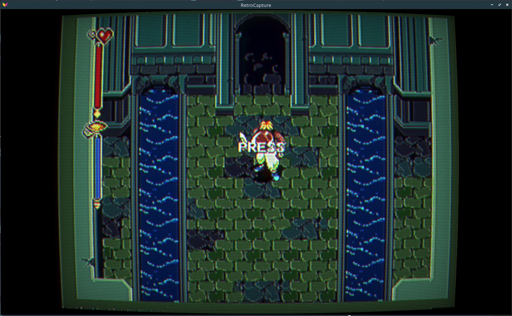

**[⬇ Download 0.8.2-alpha](https://github.com/geldoronie/RetroCapture/releases/latest)** ·
[Documentation](#documentation) ·
[Issues](https://github.com/geldoronie/RetroCapture/issues) ·
[Changelog](CHANGELOG.md)

---

## What it does

RetroCapture turns a generic capture card into a "retro-aware" capture rig:

- 🎮 **Real-time capture** from V4L2 (Linux), DirectShow (Windows) or
  AVFoundation (macOS) devices.
- 🌈 **RetroArch GLSL shaders applied live** — single-pass and multi-pass
  presets, including `PassFeedback` and the `OriginalHistory` alias chain.
- 📡 **HTTP MPEG-TS streaming** with H.264 / H.265 (VP8 / VP9 experimental)
  and PulseAudio / WASAPI system-audio capture.
- 🔁 **Shader-preserving distributed playback** — connect another RetroCapture
  in *Remote source* mode and it receives the host's pre-shader feed plus
  the host's current preset/parameters, so the picture renders with the
  exact same look on the remote machine.
- 🌎 **Public stream directory** (opt-in) — publish your stream to
  `directory.retrocapture.com` with one click and let other RetroCaptures
  discover and connect from the in-app browser.
- ☁️ **Cloudflare tunnels** — Quick (ephemeral `trycloudflare.com` URL) or
  Named (your own hostname) modes so the publish works behind CGNAT and
  on networks where you can't open ports.
- 🔒 **HTTPS everywhere** — directory and `/raw` traffic go through TLS by
  default; the bundled HTTP client probes well-known CA stores so
  AppImage builds work out of the box.
- ⏺️ **Local recording** to MP4 / MKV / AVI with AAC / MP3 / Opus audio,
  configurable resolution, FPS and bitrates.
- 💾 **Named profiles** for both streaming and recording — save / load / delete
  full configs by name from either the native UI or the web portal.
- 🌐 **Web portal**: live stream player on Home, recordings browser with
  thumbnails, full configuration UI, installable as a PWA.
- ⚡ **Quick Actions OSD** — stream / record / browse / disconnect buttons
  pinned on-screen and reachable even when the main UI is hidden.
- 🌍 **Bilingual UI** — English and Portuguese, switchable from Preferences.
- 🎛️ **Hardware controls** exposed directly (V4L2 / DirectShow brightness,
  contrast, saturation, hue, gain, exposure, gamma, white balance, …).
- 🥧 **Cross-platform**: Linux x86_64, Windows x86_64, Raspberry Pi 4/5
  (ARM64), Raspberry Pi 2/3/Zero (ARM32v7).

### What's new in 0.8.2-alpha

A maintenance release: a large **internal refactor** that decomposes the
"god-object" classes (app core, shader engine, UI manager, streaming/API) into
focused units for long-term maintainability — no new features — plus a few
correctness fixes and one breaking change for remote users.

- **Recording orientation fixed (#187)** — recording with the Recording tab's
  "apply shader" toggle *off* came out upside-down; recording, `/stream` and
  `/raw` now share the host's canonical orientation.
- **Remote client follows the Streaming "apply shader" toggle (#188)** —
  disabling the shader for streaming now reaches the remote client too.
- **`--stream-port` is honored (#163)** — it was being overwritten back to 8080.
- **⚠️ Breaking (remote source / streaming):** the `/raw` feed orientation was
  standardized — a 0.8.2 client paired with a pre-0.8.2 host (or vice-versa)
  renders the remote picture upside-down. **Update both ends to 0.8.2.** (#187)
- **Tooling:** the smoke-test now applies a shader preset and asserts it
  actually rendered, so a "shader does nothing" regression can't ship green.

### What's new in 0.8.1-alpha

A Windows-hardening release — every Windows bug reported against 0.8.0-alpha is
fixed, so capture, streaming, recording, audio and the virtual camera all work
on a fresh Windows install (no new features):

- **Streaming/recording no longer a gray screen (#129)** — the Windows software
  encoder now uses CRF instead of the broken ABR/VBV rate control.
- **Capture-card audio works (#137)** — the audio settings window is now
  available on Windows, the WASAPI float mix format is decoded correctly (was
  white noise), and a local audio monitor (+ resync) lets you hear the capture
  live.
- **No more monochrome/tiled capture (#135)** — NV12/UYVY/RGB32 devices are now
  converted to RGB.
- **Virtual camera shows up in OBS/Zoom (#133)** — the DirectShow filter is
  registered under the video-input category.
- Plus: Windows TLS trust store (#130), working installer shortcuts (#131),
  persistent window layout (#132), and a calmer no-device placeholder (#134).

### What's new in 0.8.0-alpha

- **macOS x86_64 port (#18)** — first working build of host + client
  modes on macOS (AVFoundation capture, Core Audio, `.app` bundle).
- **System tray + minimize-to-tray (#86)** — hide the window and keep
  every pipeline running in the background, with desktop notifications.
- **Virtual camera output (#85)** — expose the shader-processed picture
  as a webcam device for Zoom / OBS / browsers.
- **Screen capture source (#108)** — grab a monitor, window, or region
  as the capture source (PipeWire / Windows / ScreenCaptureKit).
- **System-audio capture (#109)** — capture what the machine is playing
  as an audio source, no routing tricks.
- **Real-time chat (#88)** — per-stream chat rooms bound to the
  streamer's identity, in the OSD overlay and the web portal.
- **Linux audio refactor (#78)** — direct capture + a coherent
  `RetroCapture` source/sink pair, no more `module-null-sink` loopback.
- **Client-side stream volume (#77)** and a wave of remote-client
  A/V-sync + streaming-stability fixes (shared-epoch sync,
  reconnect-to-live, chunked `/meta`, dual-encode gating).

See [`CHANGELOG.md`](CHANGELOG.md) for the full list.

---

## At a glance

### Shader comparison

RetroCapture applies RetroArch presets in real time. Same capture, different
shader:

| Without shader | CRT Mattias |
| -------------- | ----------- |
| 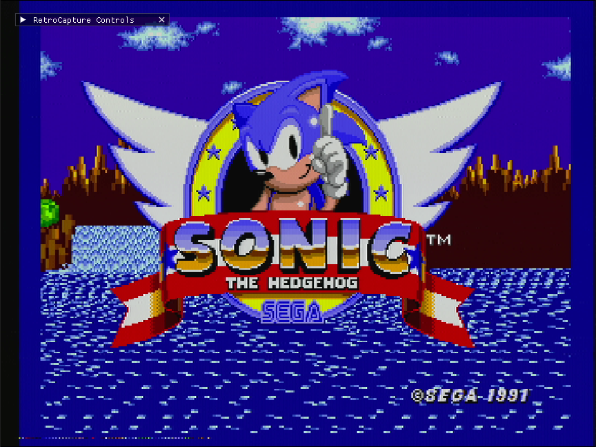 | 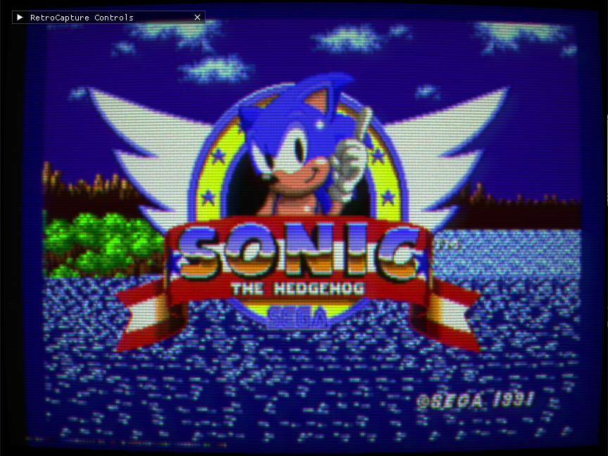 |

| Without shader | NTSC |
| -------------- | ---- |
| 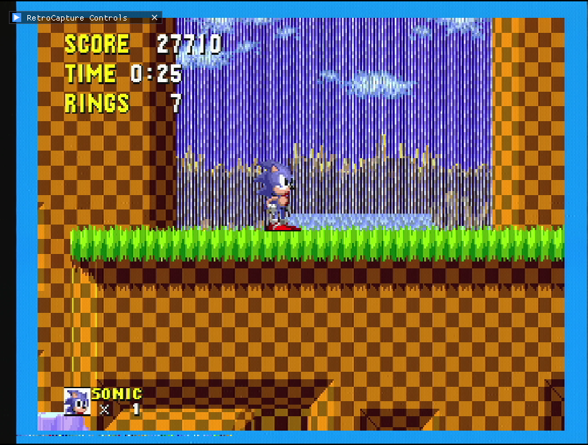 | 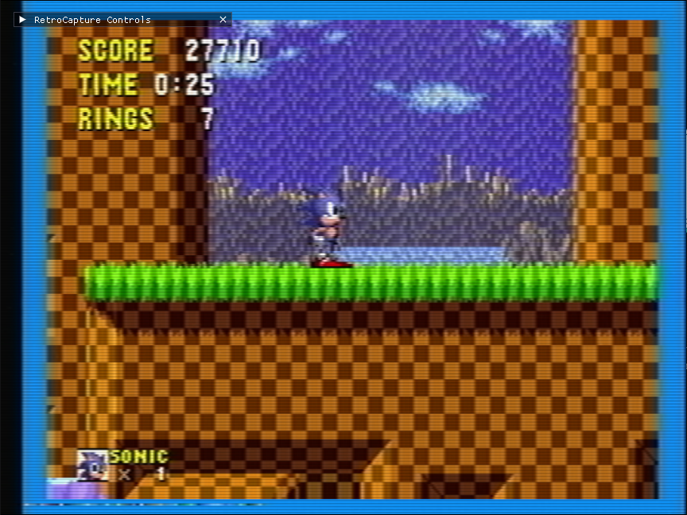 |

### Native UI

<!-- SCREENSHOT NEEDED: native ImGui UI with the Shaders tab open and a CRT
     preset selected, showing the parameter sliders on the right. Capture at
     ~1280x720. Save as docs/screenshots/native-ui-shaders.png -->
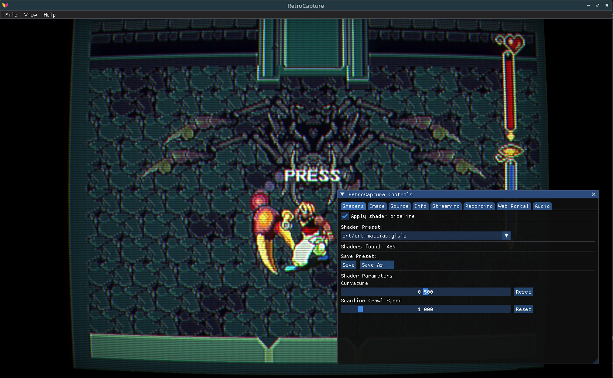

### Web portal — Home (live player)

<!-- SCREENSHOT NEEDED: web portal Home page, browser window at ~1280x800.
     Show the embedded MPEG-TS player playing real content, the status panel
     (FPS, bitrate, clients), and the top navigation. Save as
     docs/screenshots/portal-home.png -->
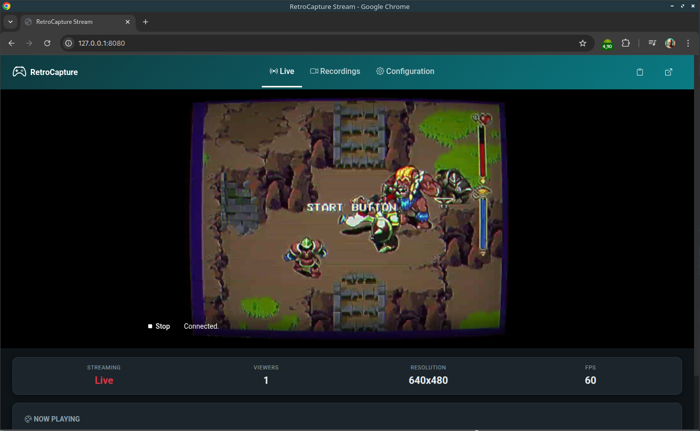

### Web portal — Recordings browser

<!-- SCREENSHOT NEEDED: web portal Recordings page with a few recordings
     listed (thumbnails visible, durations, sizes). Save as
     docs/screenshots/portal-recordings.png -->
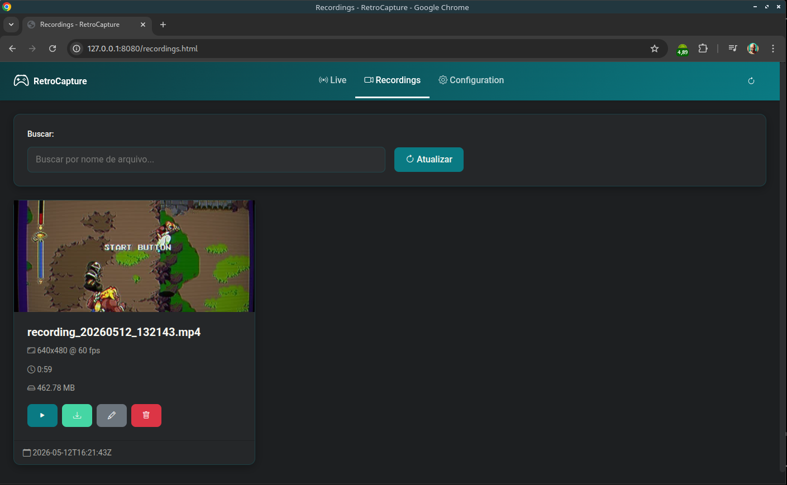

### Web portal — Configuration

<!-- SCREENSHOT NEEDED: web portal Configuration page on the Stream or
     Recording section, showing the profile selector + codec / bitrate
     controls. Save as docs/screenshots/portal-config.png -->
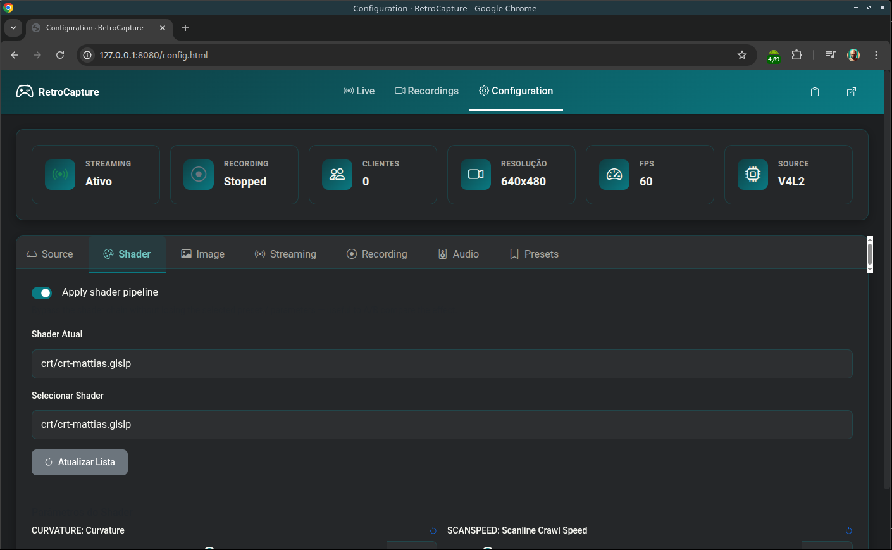

### Mobile (PWA)

<!-- SCREENSHOT NEEDED: phone-sized capture (e.g. 390x844) of the portal
     installed as a PWA. Save as docs/screenshots/portal-mobile.png -->
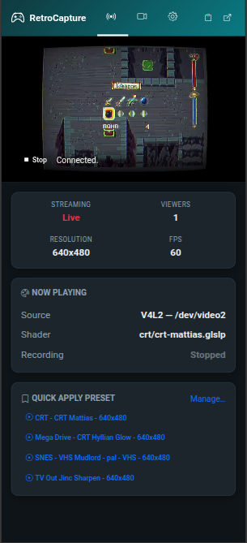

### Profiles in action

<!-- SCREENSHOT NEEDED: profile management modal/panel — either the recording
     profile selector with a few saved profiles or the streaming one. Save as
     docs/screenshots/profiles.png -->
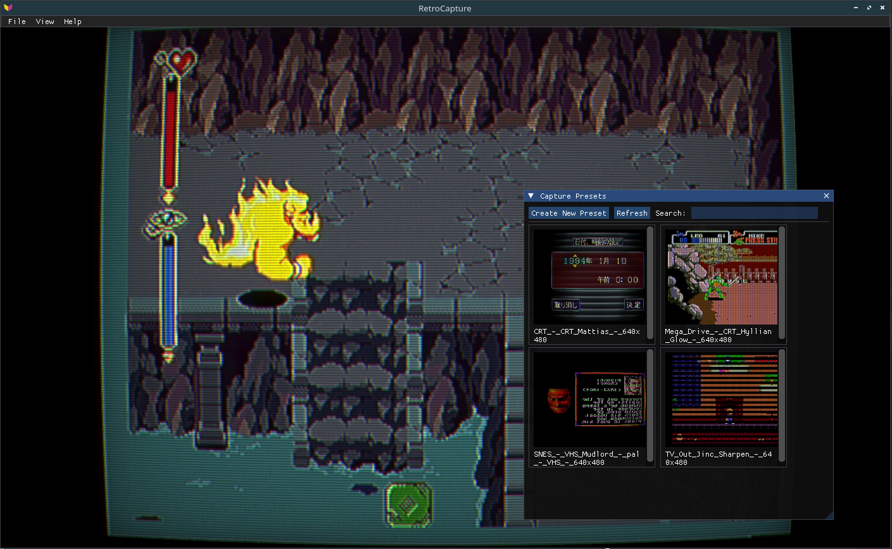

---

## Download

Pre-built binaries for **0.8.2-alpha** are attached to the
[latest GitHub release](https://github.com/geldoronie/RetroCapture/releases/latest):

| Platform | Artifact |
| --- | --- |
| Linux x86_64 | `RetroCapture-0.8.2-alpha-linux-x86_64.AppImage` |
| Linux ARM64 (Raspberry Pi 4 / 5) | `RetroCapture-0.8.2-alpha-linux-arm64v8.tar.gz` |
| Linux ARM32v7 (Raspberry Pi 2 / 3 / Zero 2) | `RetroCapture-0.8.2-alpha-linux-arm32v7.tar.gz` |
| Windows x86_64 | `RetroCapture-0.8.2-alpha-windows-x86_64-Setup.exe` |
| macOS x86_64 | `RetroCapture-0.8.2-alpha-macos-x86_64.tar.gz` |

A `SHA256SUMS` file is published alongside the binaries.

> The Linux x86_64 build targets a portable instruction-set baseline
> (no AVX/AVX2) so it runs on a wide range of CPUs including older
> Sandy/Ivy Bridge, low-power and virtualized systems.

To build from source instead, see [Building](#building) below.

---

## Status

RetroCapture is **alpha** and actively developed. Most things work; some
edges are still being polished.

| Area | State |
| --- | --- |
| Live capture (V4L2 / DirectShow) | ✅ Stable |
| Shader pipeline (single-pass, multi-pass, PassFeedback, OriginalHistory) | ✅ Stable |
| H.264 streaming | ✅ Stable |
| H.265 streaming | ✅ Stable |
| VP8 / VP9 streaming | ⚠️ Functional but may show as "Data: bin_data" in some players |
| Local recording (MP4 / MKV / AVI) | ✅ Stable as of 0.6.0 (PTS fix landed) |
| Web portal | ✅ Stable (full overhaul in 0.6.0) |
| Profiles (streaming + recording) | ✅ Stable since 0.6.0 |
| Raspberry Pi (ARM64 / ARM32) | ✅ Headless via SDL2 + DirectFB |
| **Remote source mode (`/raw` + `/meta`)** | ✅ New in 0.7.0-alpha |
| **Public stream directory + Cloudflare tunnels** | ✅ New in 0.7.0-alpha |
| **HTTPS / TLS for directory and `/raw`** | ✅ New in 0.7.0-alpha |
| **Bilingual UI (EN / PT-BR)** | ✅ New in 0.7.0-alpha |
| **Quick Actions OSD + Shortcuts helper** | ✅ New in 0.7.0-alpha |
| **macOS x86_64 (host + client)** | ✅ New in 0.8.0-alpha |
| **System tray + minimize-to-tray** | ✅ New in 0.8.0-alpha |
| **Virtual camera output** | ✅ New in 0.8.0-alpha |
| **Screen capture source (monitor / window / region)** | ✅ New in 0.8.0-alpha |
| **System-audio capture source** | ✅ New in 0.8.0-alpha |
| **Real-time chat (per-stream rooms)** | ✅ New in 0.8.0-alpha |

**Shader compatibility note:** most CRT, NTSC, upscale (xBR, Super-xBR) and
handheld presets work cleanly. A handful of complex multi-pass presets are
still being shaken out — bug reports very welcome.

For the full per-version history see [`CHANGELOG.md`](CHANGELOG.md).

---

## Quick start

### Linux (AppImage)

```bash
# Download from Releases, then:
chmod +x RetroCapture-0.8.2-alpha-linux-x86_64.AppImage
./RetroCapture-0.8.2-alpha-linux-x86_64.AppImage --source v4l2 --v4l2-device /dev/video0
```

### Windows

Run the installer (`RetroCapture-0.8.2-alpha-windows-x86_64-Setup.exe`),
then launch RetroCapture from the Start menu. DirectShow is the default
capture source on Windows.

### Raspberry Pi

```bash
tar -xzf RetroCapture-0.8.2-alpha-linux-arm64v8.tar.gz
cd RetroCapture-0.8.2-alpha-linux-arm64v8
./retrocapture --source v4l2 --v4l2-device /dev/video0
```

For Pi 2 / 3 / Zero 2, use the `arm32v7` tarball instead.

### Useful flags

```bash
# Apply a shader preset
./retrocapture --preset shaders/shaders_glsl/crt/crt-guest-dr-venom.glslp

# Custom resolution and framerate
./retrocapture --width 1920 --height 1080 --fps 60

# Fullscreen on monitor 1
./retrocapture --fullscreen --monitor 1 --maintain-aspect

# No capture device (dummy mode for testing)
./retrocapture --source none

# Custom web portal port + HTTPS
./retrocapture --web-portal-port 9000 \
               --web-portal-https \
               --web-portal-ssl-cert ssl/server.crt \
               --web-portal-ssl-key ssl/server.key
```

Press **F12** to toggle the native UI. Run `./retrocapture --help` for the
full list of command-line flags (source selection, hardware controls,
streaming, web portal, …).

---

## Streaming

Once streaming is enabled (UI Stream tab, web portal, or `--stream-enable`),
the MPEG-TS stream is served at `http://<host>:8080/stream`:

```bash
# ffplay
ffplay http://localhost:8080/stream

# VLC
vlc http://localhost:8080/stream

# mpv
mpv http://localhost:8080/stream
```

Multiple clients can connect simultaneously. Bitrate, codec, resolution and
audio are configured from the UI or via the REST API.

---

## Web portal

The web portal runs on the same port as the stream (default `8080`) and
gives you full remote control of the application from any browser on
your network:

- **Home** — live MPEG-TS player (vendored `mpegts.js` with native fallback)
  plus live status (FPS, bitrate, connected clients).
- **Recordings** — browse, download, rename and delete recordings with
  generated thumbnails.
- **Configuration** — every other setting: source, shader, image processing,
  stream, recording, hardware controls, profiles.
- **Offline / PWA** — Bootstrap and Bootstrap Icons are fully vendored and
  the portal works offline via a service worker; can be installed as a PWA
  on mobile and desktop.

For PWA installation over a local-network IP, HTTPS is required.
See [`ssl/README.md`](ssl/README.md) for certificate generation.

---

## Background operation

RetroCapture can run in the background with its window hidden — handy
when you've armed the virtual camera and just want it feeding OBS /
Zoom / Discord all day, or you're hosting a stream and want the screen
back.

- A **system-tray icon** appears on launch (configurable). Right-click
  it for quick actions — start/stop streaming, start/stop recording,
  open the web portal, show/hide the window, and **quit**.
- The window's **close button minimizes to the tray** by default
  (toggle to quit-on-close under **Preferences → System tray**). While
  hidden, capture, shaders, streaming, recording, the virtual camera
  and chat all keep running — only the on-screen view is paused.
- Left-click the tray icon to toggle the window.

Platform notes:

- **Linux** uses StatusNotifierItem (D-Bus). KDE/Plasma, XFCE, Cinnamon
  and MATE support it natively; on GNOME install the *AppIndicator and
  KStatusNotifierItem Support* extension. If your desktop has no tray
  host, the icon won't show and the close button quits instead.
- **Windows** and **macOS** use the native tray (`Shell_NotifyIcon` /
  `NSStatusItem`).

---

## Building

> Production builds use the Docker scripts, which default to a portable
> instruction-set baseline. Native CMake builds default to `-march=native`.

### One-shot — build every release artifact

```bash
./tools/package-release.sh
```

This runs every platform build in sequence (AppImage x86_64, Linux ARM64,
Linux ARM32v7, Windows installer) and emits artifacts under `dist/` plus a
`SHA256SUMS` file. Use `--only-x86`, `--only-arm`, `--only-win` etc. to
build a subset.

### Per-platform scripts

```bash
# Linux x86_64 AppImage (Docker — portable baseline)
./tools/build-linux-appimage-x86_64.sh

# Linux ARM64 / ARM32 cross-compile (Docker + qemu)
./tools/build-linux-arm64v8-docker.sh
./tools/build-linux-arm32v7-docker.sh

# Windows installer (NSIS via MXE Docker)
./tools/build-windows-installer.sh

# Native Linux build (uses your local toolchain)
./build.sh
```

All Docker scripts auto-build their image on first run.

### Native build on Raspberry Pi

```bash
./tools/install-deps-raspberry-pi.sh
./tools/build-on-raspberry-pi.sh
```

### Dependencies

**Linux**: V4L2, OpenGL 3.3+, GLFW 3.x, libv4l2, libpng, X11, CMake 3.10+,
C++17 compiler.

**Windows**: DirectShow-capable device, OpenGL 3.3+, CMake 3.10+, MinGW-w64
or MSVC.

**Both**: FFmpeg 6.x (libavcodec / libavformat / libavutil / libswscale /
libswresample) with libx264 (mandatory) and libx265 / libvpx (optional);
nlohmann/json (auto-fetched by CMake); OpenSSL (optional, for HTTPS).

---

## Documentation

- [`CHANGELOG.md`](CHANGELOG.md) — full version history.
- [`docs/ARCHITECTURE.md`](docs/ARCHITECTURE.md) — system architecture,
  components, data flow, threading model.
- [`docs/CONTRIBUTING.md`](docs/CONTRIBUTING.md) — commit conventions
  and development process.

---

## Contributing

Bug reports, shader-compatibility reports and PRs are very welcome.

Before opening a PR, please read [`docs/CONTRIBUTING.md`](docs/CONTRIBUTING.md)
for commit conventions and [`docs/ARCHITECTURE.md`](docs/ARCHITECTURE.md)
for an orientation tour of the codebase.

When reporting a shader that misrenders, please include:

- The preset path (e.g. `shaders/shaders_glsl/crt/<name>.glslp`)
- Any error messages from the log
- Expected vs. actual behavior (a screenshot helps a lot)
- GPU + driver version

---

## License

MIT — see [`LICENSE`](LICENSE).

---

## Acknowledgments

- The **RetroArch community** for the extensive shader library and the
  GLSL spec that this project implements against.
- The maintainers of **GLFW**, **Dear ImGui**, **FFmpeg**, **mpegts.js**,
  **Bootstrap** and **nlohmann/json**.

**Note:** RetroCapture is an independent project and is not affiliated with
RetroArch, Libretro, Sega, Nintendo, or any other trademark referenced.
